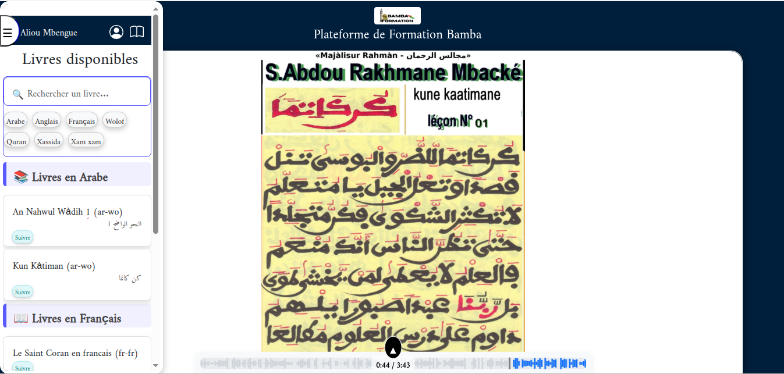

#📘 Bamba Formation

Plateforme PWA de formation en ligne — livres numériques en images + audios synchronisés
Développé en PHP, MySQL/SQLite, JavaScript, Bootstrap

## Capture d'écran

## 🚀 Présentation

Bamba Formation est une application web moderne permettant d’apprendre des livres numériques sous forme :

- d’images (pages du livre)

- d’audios synchronisés

- d’un lecteur intelligent permettant de suivre la progression

- d’une interface PWA (installable sur téléphone)

Elle inclut :

- Authentification utilisateur

- Ajout de livres à Mes Livres

- Suivi d’avancement pour chaque livre

- Moteur de recherche avancé

- Filtres par :

-- langue (Arabe, Français, Wolof, Anglais…)

-- catégories (Quran, Xassida, Xam Xam, etc.)

- Version fallback en SQLite si MySQL n’est pas disponible

## 🗂 Structure du projet

- /assets/books → Échantillon de livres (version GitHub)

- /assets/books_sample_local → version complète (ignorée par Git)

- /api/ → backend PHP (auth, livres, progression…)

- /pwa/ → manifest + service workers

- /views/ → pages Bootstrap

- /database/ → scripts MySQL + SQLite

## 🎧 Fonctionnalités audio

- Lecture audio page par page

- Saut automatique en fonction du livre consulté

- Synchronisation audio/image

- Avancement sauvegardé local + serveur

## 🔐 Gestion des utilisateurs

### Rôles disponibles :

- **Utilisateur** : lecture + progression

- **Admin** : ajout/édition livres, gestion utilisateurs

Connexion sécurisée, sessions, token local, fallback offline.
